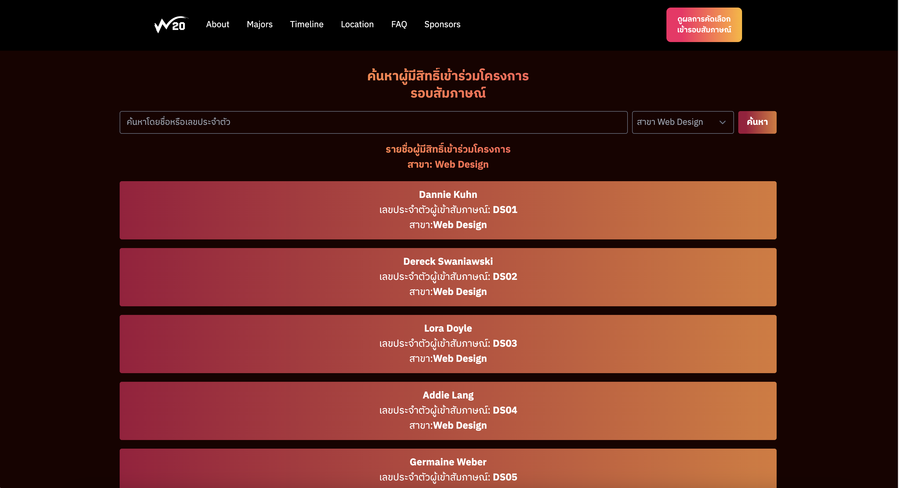

# Young Webmaster Camp 20 Website PG02
## Siravij Praevisavakij
 Powered by SvelteKit


## Features
-   Seach using Name,Lastname,Reference
- - by fetch and we manual select using mapped json 
```
	const categories = [
		['design', 'สาขา Web Design'],
		['programming', 'สาขา Web Programming'],
		['marketing', 'สาขา Web Marketing'],
		['content', 'สาขา Web Content']
	];
```
```
			const response = await fetch('https://api.ywc20.ywc.in.th/homework/candidates', {
				headers: {
					'Content-Type': 'application/json',
					'x-reference-id': 'PG02'
				}
			});
			if (response.status === 200) {
				fullData = await response.json();
			-->	const categoryData = fullData[selectedCategory] || [];

```
then we fillter it by lowercase then filter 
```
			.filter(
				(item) =>
					item.firstName.toLowerCase().includes(q) ||
					item.lastName.toLowerCase().includes(q) ||
					item.interviewRefNo.toLowerCase().includes(q)
			)
			.sort((a, b) => {
				// Sort by firstName first, then lastName
				const firstNameComparison = a.firstName.localeCompare(b.firstName);
				if (firstNameComparison === 0) {
					return a.lastName.localeCompare(b.lastName);
				}
				return firstNameComparison;
			});
```
if using change option then call filter function

```
	function filterOntype() {
		const categoryData = fullData[selectedCategory] || [];

		// Simple search: match query in firstName, lastName, or interviewRefNo
		const q = searchQuery.toLowerCase();results = categoryData
			.filter(
				(item) =>
					item.firstName.toLowerCase().includes(q) ||
					item.lastName.toLowerCase().includes(q) ||
					item.interviewRefNo.toLowerCase().includes(q)
			)
			.sort((a, b) => {
				// Sort by firstName first, then lastName
				const firstNameComparison = a.firstName.localeCompare(b.firstName);
				if (firstNameComparison === 0) {
					return a.lastName.localeCompare(b.lastName);
				}
				return firstNameComparison;
			});
	}
```

## Future fix
-   Group function to less side effect